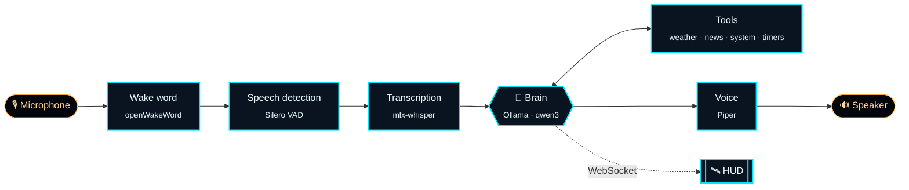

<div align="center">



<br>


**A voice assistant that lives on your Mac, not in someone else's data center.**<br>
The language model, speech recognition and voice all run locally: no API keys, no tokens, no cloud.

[Features](#-features) · [Architecture](#-architecture) · [Quick start](#-quick-start) · [Personalization](#-personalization) · [Roadmap](#-roadmap)

</div>

<br>

## ◈ Features

<table>
  <tr>
    <td width="33%" valign="top">
      <h3>🎙️ Voice-first</h3>
      Wake word, speech-to-text and a natural voice, all on-device. Replies stream sentence by sentence, so Jarvis starts talking before it finishes thinking.
    </td>
    <td width="33%" valign="top">
      <h3>🔒 100% local</h3>
      Runs on Apple Silicon through Ollama and MLX. Your conversations never leave your machine. Only weather and news touch the internet, through free, keyless APIs.
    </td>
    <td width="33%" valign="top">
      <h3>🎩 A butler's manners</h3>
      Formal, polite and dry-witted. Addresses you by the title and name you choose, with correct grammatical gender.
    </td>
  </tr>
  <tr>
    <td valign="top">
      <h3>🌦️ Activation briefing</h3>
      On start, Jarvis greets you with the local weather and the one or two AI headlines that matter, fetched while the models load.
    </td>
    <td valign="top">
      <h3>🌍 Multilingual</h3>
      Full support for English and Portuguese, including dates, seasons by hemisphere and voices. Other languages work too.
    </td>
    <td valign="top">
      <h3>🛰️ Futuristic HUD</h3>
      An original holographic interface: spinning rings that react to the voice, live panels and per-state animations.
    </td>
  </tr>
</table>

## ◈ Architecture



## ◈ Quick start

> [!NOTE]
> Requires macOS on Apple Silicon and [Homebrew](https://brew.sh). Python 3.12 is installed automatically by uv. Tested on an M4 with 16 GB running macOS 26.

```bash
git clone https://github.com/MichelleBudri/my-jarvis.git && cd my-jarvis
cp .env.example .env        # your name, city and language
./scripts/setup.sh          # installs uv + Ollama, pulls the model and voice, runs a health check
uv run python -m backend voice  # say "Hey Jarvis", then ask
```

The setup downloads the language model (`qwen3:8b`, about 5.2 GB), the speech recognition model (`whisper-small`, about 0.5 GB), the Piper voice for your language and the "Hey Jarvis" wake word model (about 4 MB).

### Commands

| Command | What it does |
|---|---|
| `uv run python -m backend voice` | Voice conversation: say "Hey Jarvis", ask, and Jarvis answers out loud. Starts with the weather and AI news (`--no-briefing` skips it, `--no-wake` listens all the time) |
| `uv run python -m backend chat` | Text chat with streaming replies (`-s` reads them aloud, `-r` resumes the last conversation) |
| `uv run python -m backend doctor` | Health check: Ollama, models, voice, wake word, microphone, owner, location |
| `uv run python -m backend briefing` | Print the activation briefing with its timings (`-s` reads it aloud) |
| `uv run python -m backend wake-test` | Live wake word scores, to tune the detection threshold |
| `uv run python -m backend bench [models...]` | Compare LLM latency across Ollama models over a short scripted conversation |
| `uv run python -m backend bench-stt [models...]` | Record one phrase and compare Whisper models on it |
| `uv run python -m backend prompt` | Print the current system prompt |
| `uv run python -m backend config` | Print the effective configuration |
| `uv run pytest` · `uv run ruff check .` | Tests and lint |

## ◈ Personalization

Personal settings live in `.env`, which is never committed. See [`.env.example`](.env.example).

| Variable | Example | Effect |
|---|---|---|
| `JARVIS_LANGUAGE` | `en-GB` · `en-US` · `pt-BR` · `es` | Persona, dates, titles, voice and transcription |
| `JARVIS_OWNER_NAME` | `Michelle` | Your name |
| `JARVIS_OWNER_GENDER` | `female` · `male` · `neutral` | Default title (madam / sir) and grammatical agreement |
| `JARVIS_OWNER_TITLE` | `madam` · `Dr. Smith` | How Jarvis addresses you; empty = default for language and gender |
| `JARVIS_CITY` | `London, England, United Kingdom` | Weather, timezone and season |
| `JARVIS_LATITUDE` · `_LONGITUDE` · `_TIMEZONE` | `51.51` · `-0.13` · `Europe/London` | Optional: skips the city lookup |

<details>
<summary><b>Languages</b></summary>
<br>

English and Portuguese are fully supported. In English, Jarvis uses the British voice `en_GB-alan-medium`. Other languages use the English prompt plus an instruction to reply in the chosen language; set a compatible [Piper voice](https://huggingface.co/rhasspy/piper-voices) in `JARVIS_TTS__VOICE`.

</details>

<details>
<summary><b>Location</b></summary>
<br>

The city is resolved to coordinates and a timezone with the [Open-Meteo geocoding API](https://open-meteo.com/en/docs/geocoding-api) (free, no key) and cached in `data/location.json`. Adding the state or country helps pick the right city when names repeat.

</details>

<details>
<summary><b>Project defaults</b></summary>
<br>

The model, voice and news feeds are set in [`config.yaml`](config.yaml). Any key can be overridden with an environment variable, using `__` between sections:

```bash
JARVIS_LLM__MODEL=qwen3.5:4b uv run python -m backend voice
```

</details>

<details>
<summary><b>Tools</b></summary>
<br>

Jarvis calls tools on its own when a question needs live data or an action:

| Tool | Ask things like | Source |
|---|---|---|
| Weather | "How's the weather?" · "Will it rain tomorrow?" · "And in Lisbon?" | [Open-Meteo](https://open-meteo.com) (free, no key) |
| AI news | "Any AI news?" · "Anything about robots?" | RSS feeds in `config.yaml` (`news.feeds`) |
| System | "How much battery is left?" · "Set the volume to 30" · "Open Safari" | macOS (`pmset`, `osascript`, `open`) |
| Timers | "Remind me in 10 minutes to take the cake out" · "Make it 15" · "Cancel the timer" | Local; announced out loud when they end |

In voice mode, saying goodbye, "that's all" or "you can rest" sends Jarvis back to sleep. Unmuting brings back the volume you had before. Turn tools off with `tools.enabled` in `config.yaml` (for example `JARVIS_TOOLS__ENABLED='["weather", "timers"]'`). Timers live in memory and are cleared when Jarvis quits.

</details>

<details>
<summary><b>Voice and microphone</b></summary>
<br>

The first time Jarvis captures audio, macOS asks for microphone access for the app running it (Terminal, iTerm, VS Code...). If you deny it by mistake, enable it in **System Settings → Privacy & Security → Microphone**.

Jarvis sleeps until it hears **"Hey Jarvis"** (a rising chime confirms it). You can ask in the same breath ("Hey Jarvis, what time is it?") or wait for the chime. After each reply it keeps listening for 8 seconds, so follow-up questions need no wake word; then a falling chime means it went back to sleep. "Ei Jarvis" works too, so the wake word is fine in Portuguese.

```
sleeping ──"Hey Jarvis"──▶ listening ──speech──▶ thinking ──▶ speaking
    ▲                       │     ▲                              │
    └── silence (6 s) ──────┘     └──── reply done (8 s window) ─┘
```

If it misses you or wakes up by itself, run `uv run python -m backend wake-test` and adjust `JARVIS_WAKEWORD__THRESHOLD` (default 0.5; lower is more sensitive). The timings are `JARVIS_WAKEWORD__LISTEN_TIMEOUT_S` and `_FOLLOW_UP_S`, and `JARVIS_WAKEWORD__CHIME=false` silences the chimes.

By default Jarvis is half duplex: it stops listening while it thinks and speaks, so it never hears itself through the speakers. With headphones you can turn on barge-in and interrupt it mid-sentence:

```bash
JARVIS_AUDIO__BARGE_IN=true uv run python -m backend voice
```

On start, Jarvis says the briefing: a greeting and today's weather, written from the forecast numbers, then the most relevant AI headlines picked and retold by the model, which writes them while the first part is spoken. It starts about 2 seconds after launch, before speech recognition has finished loading, and ends with a line showing when each part was ready. A source that fails or takes over `JARVIS_BRIEFING__FETCH_TIMEOUT_S` (default 5) is left out. Turn it off with `JARVIS_BRIEFING__ENABLED=false` or `voice --no-briefing`.

Other knobs: `JARVIS_VAD__SILENCE_MS` (how long a pause ends your turn, default 700), `JARVIS_TTS__LENGTH_SCALE` (speaking speed, below 1 is faster), and `JARVIS_AUDIO__INPUT_DEVICE` / `_OUTPUT_DEVICE` (list devices with `uv run python -m sounddevice`).

</details>

## ◈ Roadmap

| | Phase | Status |
|:-:|---|---|
| 0 | Foundation: settings, setup script, health check | ✅ Done |
| 1 | Text chat: streaming LLM, persona, history, personalization | ✅ Done |
| 2 | Voice in and out: VAD, Whisper, streaming Piper, barge-in | ✅ Done |
| 3 | Wake word: "Hey Jarvis", state machine | ✅ Done |
| 4 | Tools: weather, AI news, system, timers | ✅ Done |
| 5 | Activation briefing | ✅ Done |
| 6 | Holographic HUD | 🔜 Next |
| 7 | Polish: long-term memory, launch at login, echo cancellation | ⏳ Planned |


## ◈ Stack

<div align="center">


</div>

## ◈ License

[MIT](LICENSE). Jarvis is an independent hobby project and is not affiliated with Marvel or Disney.

<div align="center">
<br>
<sub><code>// SYSTEMS ONLINE · RUNNING ON YOUR MACHINE</code></sub>
</div>
